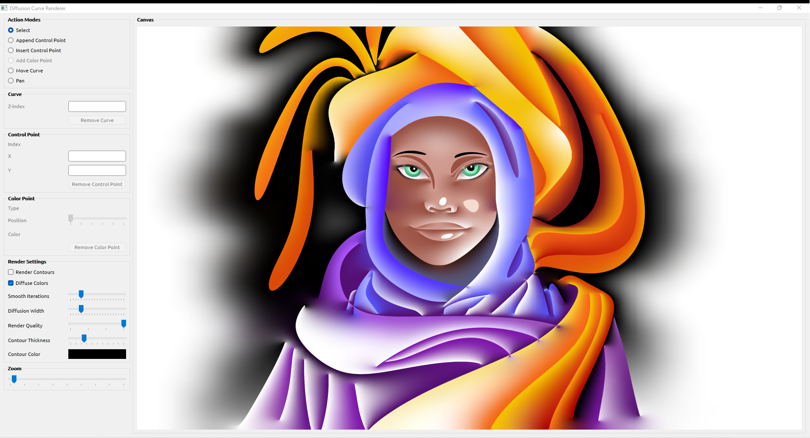

# Diffusion Curve Renderer
- Keywords: C++, Qt 6, OpenGL and GLSL
- Rendering 2D Bezier curves using OpenGL API.
- Diffusing colors constrained by Bezier curves. Diffusion algorithm belongs to [Orzan et al.](https://hal.archives-ouvertes.fr/inria-00274768/)

