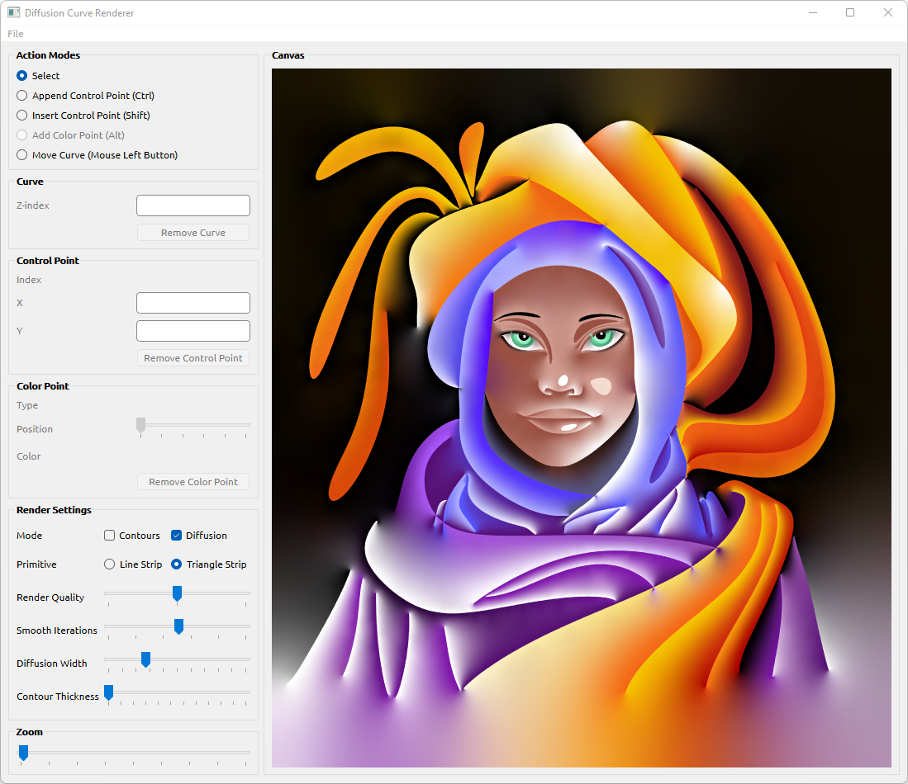
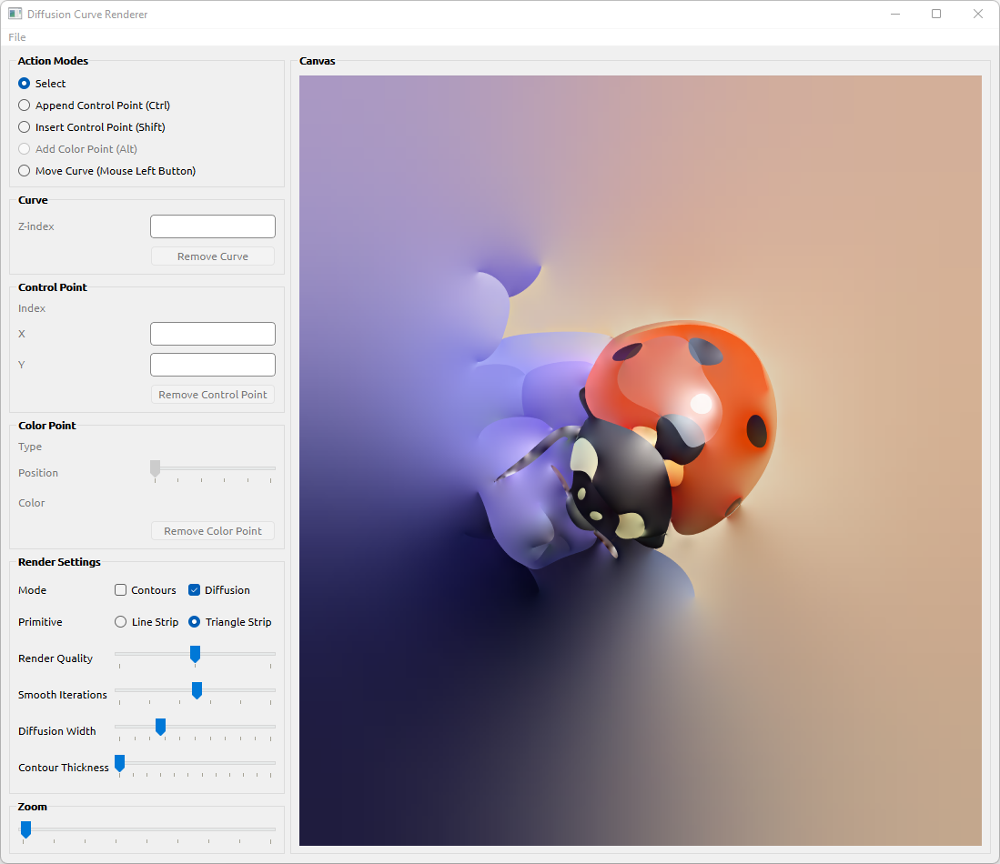

# Diffusion Curve Renderer

Rendering 2D Bezier curves using OpenGL API.
Diffusing colors constrained by Bezier curves. Diffusion algorithm belongs to [Orzan et al.](https://hal.archives-ouvertes.fr/inria-00274768/)

## Screenshots

## Keywords
C++, Qt 6, OpenGL, GLSL, Diffusion Curves, 2D Rendering, Bezier Curves
